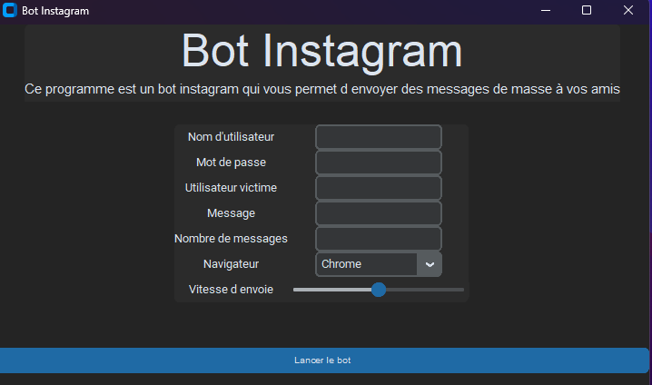

# Bot Message en boucle

Ce script utilise Selenium pour envoyer des messages en masse sur Instagram.

## Instructions

### Prérequis
- Python 3.x
- Navigateur Web (Chrome, Firefox, etc.)
- Driver du navigateur compatible avec la version installée (pour Chrome, le driver Chrome est utilisé dans cet exemple)

### Installation des dépendances
```bash
pip install selenium
```
```bash
pip install customtkinter
```
```bash
pip install CTkMessagebox   
```

### Utilisation

Pour cela il vous suffit de lancer le fichier main
```bash
python3 main.py  
```
## Appercu de l'interface



### Attention
- Utilisez ce script avec précaution pour éviter d'être bloqué par Instagram.
- L'auteur du script n'est pas responsable de l'utilisation abusive de celui-ci.
